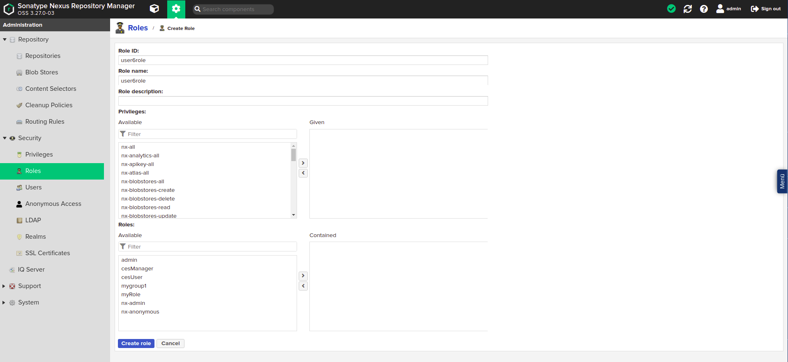
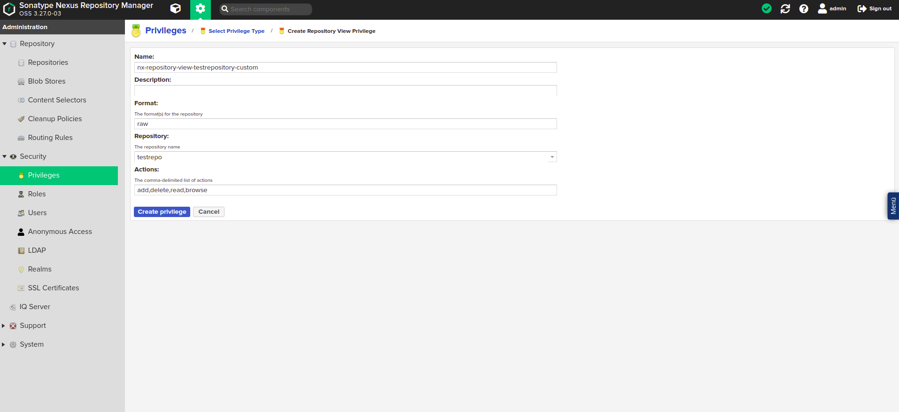

# Dokumentation

Sonatype Nexus ist eine Artifakt Repository Management-Applikation, die auf vielfältige Art verwendet werden kann. Zum einen kann die Verwendung von Bibliotheken und Komponenten vereinheitlicht werden, indem sie über Nexus bereitgestellt werden. Zum anderen können Versionen der entwickelten Software in Nexus archiviert werden.

Die offizielle Dokumentation dieser Applikation findet sich hier: https://help.sonatype.com/repomanager3

## Administrationshinweise: Rollen und Rechte im Nexus Dogu
Im Nexus Dogu existieren Nutzer und Rollen. Die Rollen entsprechen dabei den Gruppen eines Nutzers im User Management.
Dazu gibt es die sogenannten Privilegien, die bestimmen, welche tatsächlichen Berechtigungen ein Benutzer im Nexus-Dogu hat.

### Standardzustand
Grundsätzlich im Nexus angelegt wird die Gruppe "cesUser". Diese Gruppe wird jedem Benutzer zugewiesen und enthält
immer die folgenden Privilegien:

* nx-apikey-all (Der Benutzer hat sämtliche Berechtigungen für den Umgang mit dem API-Key)

* nx-healthcheck-read (Der Benutzer hat die Berechtigung, den Healthcheck zu lesen)

* nx-healthcheck-summary-read (Der Benutzer hat die Berechtigung, die Healthcheck-Summary zu lesen)

* nx-repository-view-*-*-add

* nx-repository-view-*-*-browse (Der Benutzer kann die Liste aus vorhandenen Repositories sehen)

* nx-repository-view-*-*-read (Der Benutzer kann den Inhalt vorhandener Repositories sehen)

* nx-search-read (Der Benutzer hat die Möglichkeit, die Suchfunktion zu benutzen)

* nx-userschangepw (Der Benutzer kann sein Passwort ändern)

Die Gruppe "cesAdmin" wird ebenfalls grundsätzlich angelegt und erhält das Privileg "nx-all". Das bedeutet, dass Mitglieder dieser Gruppe im Nexus sämtliche möglichen Aktionen durchführen können.

### Berechtigung und Synchronisierung
Ein Nutzer und seine Gruppen (Rollen) werden bei dessen Login synchronisiert. Falls diese im Nexus nicht existieren,
werden sie angelegt. Falls sie sich verändert haben, werden sie im Nexus verändert.
Diese Synchronisierung fuktioniert nur vom User Management zum Nexus Dogu. Werden die Daten, wie zum Beispiel Name oder
E-Mail eines Nutzers, im Nexus geändert, so werden diese bei seinem nächsten Login wieder überschrieben.
Um die Daten eines Nutzers zu verändern, müssen diese im User Management angepasst werden.

Vor dem ersten Login eines Nutzers ist es nicht bzw. nicht ohne weiteres möglich, diesem Berechtigungen zu geben, da
im Nexus der Nutzer erst dann angelegt wird, wenn er sich zum ersten Mal einloggt.
Ist aber der genaue Benutzername des Nutzers bereits bekannt, so kann dieser manuell im Nexus angelegt und berechtigt werden.
Dasselbe gilt für Gruppen (Rollen).

Die Besonderheit bei der Synchronisierung von Gruppen ist die, dass das Zuweisen von Gruppen im User Management zwar
dazu führt, dass der Nutzer im Nexus auch die entsprechende Rolle bekommt, das Entfernen von Gruppen im User Management
jedoch nicht dazu führt, dass dem Nutzer diese Gruppe im Nexus wieder entzogen wird. Dieser Schritt muss manuell erfolgen.
Die einzige Ausnahme von dieser Regel ist die "cesAdmin"-Gruppe. Diese wird den Nutzern entzogen, sobald diese im
User Management entfernt wurde.

### Weitere Informationen
Die Offizielle Dokumentation kann hier gefunden werden:
* Privilegien: https://help.sonatype.com/en/privileges.html
* Rollen: https://help.sonatype.com/en/roles.html
* Benutzer: https://help.sonatype.com/en/users.html

### Beispiel: Rechtevergabe
Für dieses Beispiel wurde im Vorraus der Benutzer "newuser6" mit der Gruppe "user6role" im User Management angelegt.

#### Optional: Legen Sie eine neue Rolle an
Dieser Schritt kann übersprungen werden, sofern sich der zu berechtigende Nutzer bereits eingeloggt hat.

Klicken Sie auf das Zahnrad, um in den Administratoren-Bereich zu gelangen. Dort klicken sie auf "Roles", "Create role" und
anschließend auf "Nexus role".

In dem nun sichtbaren Formular geben Sie eine "Role ID" und einen "Role name" ein. Dabei ist es wichtig, dass der Wert im
Feld "Role ID" exakt dem Namen der zu berechtigenden Gruppe im User Management entspricht.
Drücken Sie anschließend auf "Create role".

Die Rolle ist nun erstellt und kann einem Nutzer zugewiesen werden.

#### Optional: Legen Sie einen Nutzer an
Dieser Schritt kann übersprungen werden, sofern sich der zu berechtigende Nutzer bereits eingeloggt hat.

Klicken Sie auf das Zahnrad, um in den Administratoren-Bereich zu gelangen. Dort klicken sie auf "Users"
und anschließend auf "Create local User".

In dem nun sichtbaren Formular geben Sie die Daten des Benutzers ein. Dabei ist es wichtig, dass der Wert im Feld "ID" exakt
dem Benutzernamen des zu berechtigenden Benutzers entspricht.

Geben Sie dem Benutzer die von Ihnen erstellte Rolle. Die anderen Werte werden bei dem Login des Benutzers mit den Werten aus dem User Management überschrieben. Klicken Sie nun auf "Create local User".

Der Nutzer ist nun erstellt und kann berechtigt werden.

#### Berechtigen einer Rolle im Nexus
Wählen Sie in der Rollenübersicht die zu berechtigende Rolle aus.

Unter der Überschrift "Privileges:" können dieser Rolle nun Privilegien zugewiesen werden.

Die wichtigsten Privilegien für einen Nutzer sind:
* nx-repository-view-*-*-browse (Nutzer kann vorhandene Repositories sehen)
* nx-repository-view-*-*-read (Nutzer kann den Inhalt vorhandener Repositories sehen)
* nx-repository-view-*-*-edit (Nutzer kann den Inhalt vorhandener Repositories verändern)
* nx-repository-view-*-*-delete (Nutzer kann den Inhalt vorhandener Repositories Löschen)
* nx-repository-admin-*-*-browse (Nutzer kann vorhandene Repositories im Administrationsbereich sehen)
* nx-repository-admin-*-*-add (Nutzer kann neue Repositories im Administrationsbereich hinzufügen)
* nx-repository-admin-*-*-edit (Nutzer kann die Konfiguration vorhandener Repositories im Administrationsbereich verändern)
* nx-repository-admin-*-*-delete (Nutzer kann Repositories im Administrationsbereich Löschen)

Unter der Überschrift "Roles:" können dieser Rolle weitere Rollen hinzugefügt werden. Die Berechtigungen der hinzugefügten
Rollen sind nun auch für diese Rolle verfügbar.

Wollen Sie einer Rolle den Zugriff auf ein bestimmtes Repository geben, gibt es dafür besondere Privilegien.
Sie werden automatisch nach dem Namensschema `nx-repository-<privileg-typ>-<repository-typ>-<repositoryName>-<action>` erstellt,
sobald ein neues Repository angelegt wird.

**\<privileg-typ\>**

Der Typ eines Privilegs kann entweder "admin" oder "view" sein.
Ist der Typ "view", bezieht sich die Berechtigung auf den normalen Nutzerbereich.
Ist der Typ "admin", bezieht sich die Berechtigung auf den Administrationsbereich.

**\<repository-typ\>**

Dies ist der Typ des Repositories. Der Typ eines Repositories wird bei dessen Erstellung festgelegt. Dies kann zum Beispiel "docker" oder "raw" sein.

**\<repositoryName\>**

Das ist der Name des erstellten Repositories.

**\<action\>**

Die Aktion kann "delete", "browse", "read", "edit" oder "*" sein.
Die Aktion "delete" bezieht sich auf löschende Aktionen
Die Aktion "browse" bezieht sich auf Aktionen, die z.B. Repository-Listen anzeigen
Die Aktion "read" bezieht sich auf lesende Zugriffe
Die Aktion "edit" bezieht sich auf bearbeitende Zugriffe
Die Aktion "\*" bezieht sich auf alle vorher genannten Aktionen.

**Beispiele**

Das Privileg "nx-repository-view-raw-testrepo-browse" hat die Wirkung, dass ein Nutzer mit diesem Privileg das Repository "testrepo" in der Liste der vorhandenen Repositories sehen kann.

Das Privileg "nx-repository-admin-raw-testrepo-browse" hat die Wirkung, dass ein Nutzer mit diesem Privileg das Repository "testrepo" in der Liste der vorhandenen Repositories im Administrationsbereich sehen kann.

Das Privileg "nx-repository-view-raw-testrepo-read" hat die Wirkung, dass ein Nutzer mit diesem Privileg Inhalte aus dem Repository "testrepo" lesen kann.

#### Manuelles Erstellen von Privilegien
Alternativ kann auch ein eigenes Privileg erstellt werden, bei welchem bestimmte Aktionen festgelegt werden können.
Klicken Sie dafür im Administrationsbereich auf "Privileges" und anschließend auf "Create privilege".

Dort wählen Sie den Eintrag "Repository View", um Nutzer für den normalen Bereich zu berechtigen oder den Eintrag "Repository Admin",
um einen Nutzer für den Administrationsbereich zu berechtigen.

Ihnen wird nun ein Formular angezeigt. Füllen Sie dieses, wie im Folgenden erklärt, aus und klicken Sie dann auf "Create privilege".
Anschließend kann das Privileg wie oben beschrieben einer Rolle hinzugefügt werden.

**Name**

Ein frei wählbarer Name für das Privileg. Unter diesem Namen wird die Berechtigung später in der Liste der Privilegien gefunden.

**Description**

Eine frei wählbare Beschreibung für das Privileg.

**Repository**

Dort wählen Sie aus einer Liste Ihr gewünschtes Repository aus.

**Actions**

Die Aktionen, die für das Repository ausführbar sein sollen. Diese können hier kommasepariert eingegeben werden.

**Format**

Das Format des Repositories, für das das Privileg die Berechtigung erteilen soll. Wenn Sie sich nicht sicher sind, welches Format Ihr Repository besitzt, können Sie dies in der Liste der Repositories nachsehen.

Das Privileg kann nun, wie weiter oben beschrieben, einer Rolle zugewiesen werden.