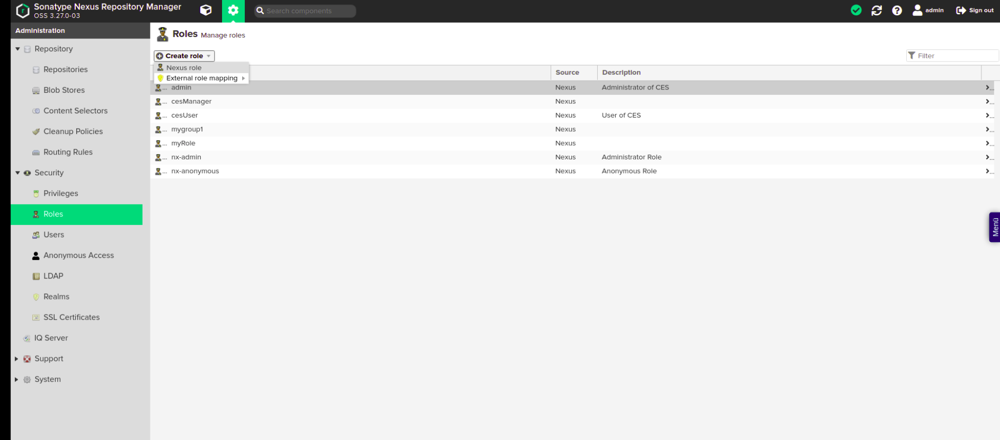
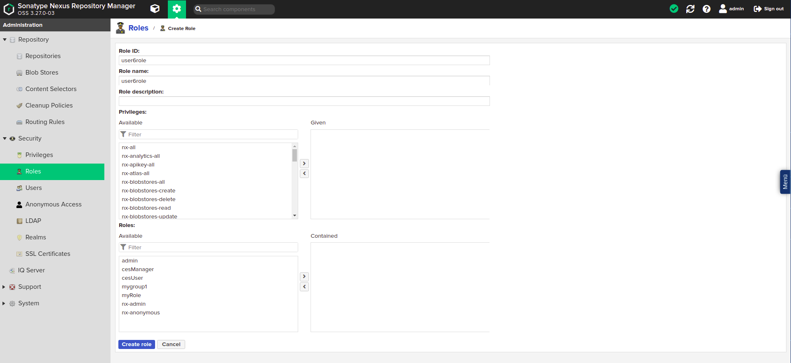
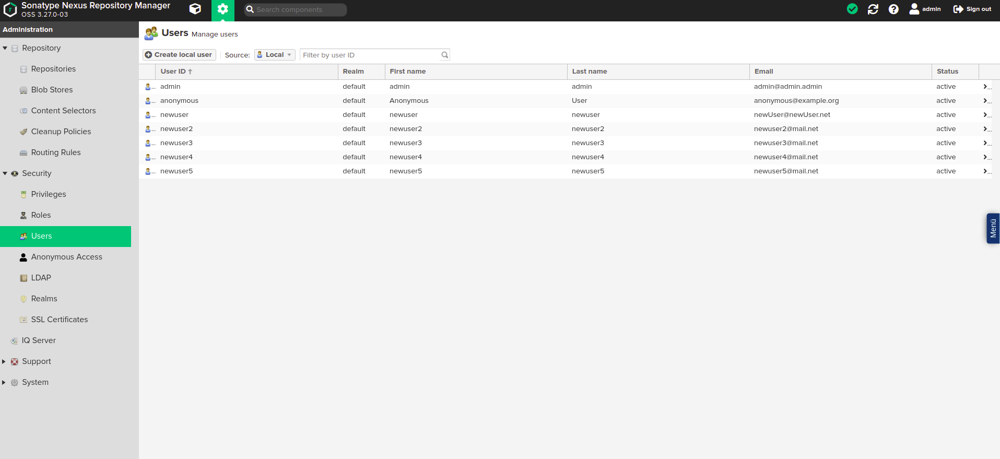
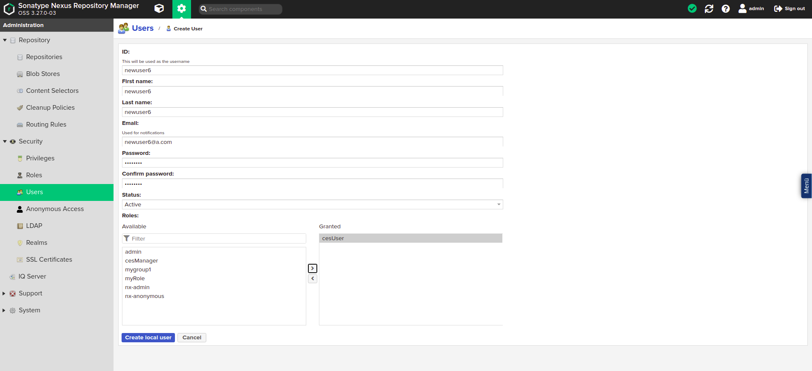
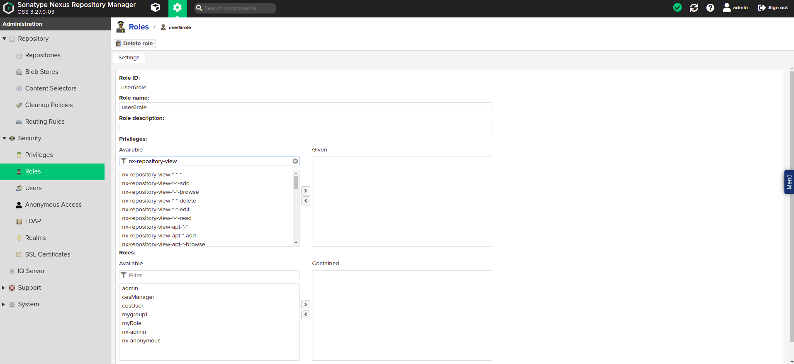
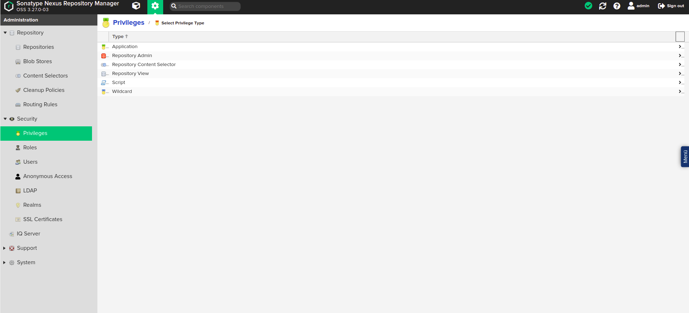
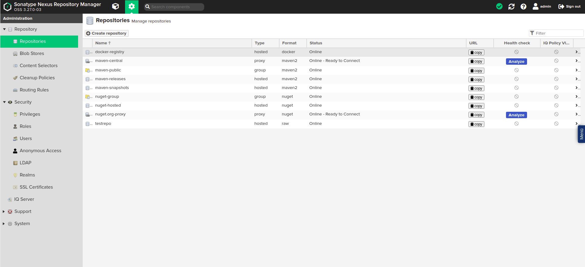

# Documentation

Sonatype Nexus is an artifact repository management application that can be used in a variety of ways. On the one hand, the use of libraries and components can be unified by making them available through Nexus. On the other hand, versions of the developed software can be archived in Nexus.

The official documentation of this application can be found here: https://help.sonatype.com/repomanager3

## Administration notes: Roles and users in Nexus Dogu
In Nexus Dogu there are roles and users. The roles correspond to the groups of a user in User Management.
In addition, there are the so-called privileges, which determine which actual authorizations a user has in Nexus Dogu.

### Default state
Basically, the "cesUser" group is created in Nexus. This group is assigned to each user and always contains
always the following privileges:

* nx-apikey-all (The user has all privileges to handle the API key).

* nx-healthcheck-read (The user has the privilege to read the healthcheck)

* nx-healthcheck-summary-read (The user has permission to read the healthcheck summary)

* nx-repository-view-*-add

* nx-repository-view-*-*-browse (The user can see the list from existing repositories)

* nx-repository-view-*-*-read (The user can see the content of existing repositories)

* nx-search-read (The user has the possibility to use the search function)

* nx-userschangepw (The user can change his password)

The group "cesAdmin" is also basically created and given the privilege "nx-all". This means that members of this group can perform all possible actions in the Nexus.

### Authorization and synchronization
A user and his groups (roles) are synchronized when he logs in. If they do not exist in the Nexus
they are created. If they have changed, they will be changed in the Nexus.
This synchronization works only from User Management to Nexus Dogu. If the data, such as name or
e-mail of a user are changed in the Nexus, they will be overwritten the next time the user logs in.
To change a user's data, it must be adjusted in User Management.

Before a user logs in for the first time, it is not or not easily possible to give him permissions, because
in Nexus the user is only created when he logs in for the first time.
However, if the exact user name of the user is already known, then this user can be created and authorized manually in the Nexus.
The same applies to groups (roles).

The special feature of the synchronization of groups is that the assignment of groups in the user management does not
the user gets the corresponding role in Nexus, but removing groups in User Management does not lead to the user
does not result in the user being deprived of this group in the Nexus. This step must be done manually.
The only exception to this rule is the "cesAdmin" group. This will be removed from the users as soon as it is removed in the
User Management has been removed.

### Further information
Official documentation can be found here:
* Privileges: https://help.sonatype.com/repomanager3/system-configuration/access-control/privileges
* Roles: https://help.sonatype.com/repomanager3/system-configuration/access-control/roles
* User: https://help.sonatype.com/repomanager3/system-configuration/access-control/users

### Example: Permissions
For this example, the user "newuser6" with the group "user6role" was created in User Management in advance.

#### Optional: Create a new role
This step can be skipped if the user to be authorized has already logged in.

Click on the cogwheel to get to the administrators area. There click on "Roles", "Create role" and then on "Nexus role".

In the now visible form enter a "Role ID" and a "Role name". It is important that the value in the Role ID" field corresponds exactly to the name of the group to be authorized in User Management.
Then press "Create role".

The role is now created and can be assigned to a user.

#### Optional: Create a user
This step can be skipped if the user to be authorized has already logged in.

Click on the cogwheel to get to the administrators area. There click on "Users
and then on "Create local User".

In the now visible form enter the data of the user. It is important that the value in the field "ID" is exactly
corresponds to the user name of the user to be authorized.

Give the user the role you created. The other values will be overwritten with the values from User Management when the user logs in. Now click on "Create local User".

The user is now created and can be authorized.

#### Authorize a role in the Nexus
Select the role to be authorized in the role overview.

Under the heading "Privileges:" privileges can now be assigned to this role.

The most important privileges for a user are:
* nx-repository-view-*-*-browse (user can see existing repositories).
* nx-repository-view-*-*-read (user can see the contents of existing repositories)
* nx-repository-view-*-*-edit (user can modify the content of existing repositories)
* nx-repository-view-*-*-delete (user can delete the content of existing repositories)
* nx-repository-admin-*-*-browse (user can view existing repositories in the administration area)
* nx-repository-admin-*-*-add (user can add new repositories in the administration area)
* nx-repository-admin-*-*-edit (user can change configuration of existing repositories in administration area)
* nx-repository-admin-*-*-delete (user can delete repositories in the administration area)

Under the heading "Roles:" additional roles can be added to this role. The permissions of the added
roles are now also available for this role.

If you want to give a role access to a specific repository, there are special privileges for it.
They are automatically created according to the naming scheme `nx-repository-<privileg-type>-<repository-type>-<repositoryName>-<action>`,
as soon as a new repository is created.

**\<privileg-type>**

The type of a privilege can be either "admin" or "view".
If the type is "view", the privilege applies to the normal user area.
If the type is "admin", the privilege refers to the administration area.

**\<repository-type\>**

This is the type of the repository. The type of a repository is set when it is created. For example, this can be "docker" or "raw".

**\<repositoryName\>**

This is the name of the created repository.

**\<action\>**

The action can be "delete", "browse", "read", "edit" or "*".
The "delete" action refers to deleting actions.
The "browse" action refers to actions that e.g. display repository lists
The action "read" refers to read accesses
The action "edit" refers to editing accesses
The "\*" action refers to all previously mentioned actions.

**Examples**

The privilege "nx-repository-view-raw-testrepo-browse" has the effect that a user with this privilege can see the repository "testrepo" in the list of existing repositories.

The "nx-repository-admin-raw-testrepo-browse" privilege has the effect that a user with this privilege can see the "testrepo" repository in the list of existing repositories in the administration area.

The "nx-repository-view-raw-testrepo-read" privilege has the effect that a user with this privilege can read content from the "testrepo" repository.

#### Creating privileges manually
Alternatively, you can create your own privilege where specific actions can be specified.
To do this, click on "Privileges" in the administration area and then on "Create privilege".

There select the entry "Repository View" to privilege users for the normal area or the entry "Repository Admin",
to authorize a user for the administration area.

You will now be presented with a form. Fill it out as explained below and then click on "Create privilege".
Afterwards you can add the privilege to a role as described above.

**Name**

A freely selectable name for the privilege. Under this name the privilege will be found later in the list of privileges.

**Description**

A freely selectable description for the privilege.

**Repository**

Here you select your desired repository from a list.

**Actions**

The actions that should be executable for the repository. These can be entered here separated by commas.

**Format**

The format of the repository for which the privilege should grant permission. If you are not sure what format your repository has, you can look it up in the list of repositories.

The privilege can now be assigned to a role as described above.